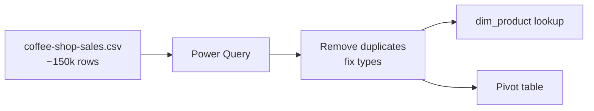

# Lab 01: Cleaning Coffee Shop Sales Data in Excel

## Objectives

- **Part 1:** Import the raw transaction export and assess data quality
- **Part 2:** Fix data types and remove duplicate transaction rows
- **Part 3:** Build a lookup table for store locations and products
- **Part 4:** Produce a first pivot table answering a real question

## Background / Scenario

A three-location coffee shop chain exports transactions from its point-of-
sale system as a single CSV: every sale, every location, every product, all
in one flat file. Nobody has looked at revenue by store or by product
category, the export just accumulates.

This lab is the first step in this series: get the raw export into a shape
a human can actually read, using only Excel and Power Query.

## Required Resources

- Excel 2021 or later, or Microsoft 365
- `data/coffee-shop-sales.csv`, the [Coffee Shop Sales, Maven Roasters
  dataset](https://www.kaggle.com/datasets/ahmedabbas757/coffee-sales)
  (Kaggle, CC0). Free Kaggle account needed to download.
- Approximately 2 hours

## Topology



---

## Part 1: Import and Assess

### Step 1: Load the CSV

**Data → Get Data → From Text/CSV** → `coffee-shop-sales.csv`. Load it as a
table, not directly into Power Query yet. Look at it raw first.

### Step 2: Check the columns you actually have

| Column | Expected type | What to check |
|---|---|---|
| transaction_id | Number | Unique per row? |
| transaction_date | Date | Consistent format? |
| transaction_time | Time | Separate from date |
| store_id / store_location | Number / Text | How many distinct stores? |
| product_id | Number | Matches a product list? |
| product_category | Text | How many categories? |
| unit_price | Currency | Any zero or negative values? |
| transaction_qty | Number | Any zero or negative values? |

Use **Data → Data Validation** or a quick `COUNTIF` to spot-check each
column before trusting any of it.

> **Why check before cleaning.** A pivot table built on data you haven't
> looked at will produce a number that's wrong in a way you can't see. It
> will just look like an answer.

<details>
<summary>Hint</summary>

`COUNTIF` on `unit_price` for the value 0 is the fastest way to find rows
worth a second look. A $0.00 unit price usually means a comped drink or a
till error, not a real sale, and it will quietly drag your average price
down in Lab 02 if you don't decide what to do with it now.

</details>

### Step 3: Find the actual problem

Sort by `transaction_id`. Some IDs repeat, the same sale exported twice.
Count them: `=SUMPRODUCT((COUNTIF(A:A,A:A)>1)*1)`.

<details>
<summary>Hint</summary>

If the formula returns 0, check that `transaction_id` was actually
imported as a number and not as text with leading spaces. Excel treats
`"1001"` and `"1001 "` as different values, which would hide real
duplicates from `COUNTIF`.

</details>

**Expected result:** a small but nonzero number of duplicate transaction
IDs. The export process double-writes rows when the POS system retries a
failed sync.

<details>
<summary>Expected result, Part 1</summary>

Total row count is close to 150,000 but not a round number. Duplicate
transaction IDs are a small fraction of that, typically under 1%. Store
IDs run 1 through 3 (three locations). Product categories land somewhere
around 8-9 distinct values (Coffee, Tea, Bakery, and similar). No unit
price should be negative; a handful of exact-zero rows is plausible and
worth a note, not necessarily a fix.

</details>

---

## Part 2: Fix Types and Remove Duplicates

### Step 1: Send the table to Power Query

Select the table → **Data → From Table/Range**.

### Step 2: Set explicit data types

Power Query guesses types from a sample of rows, and a guess made on the
first 1,000 rows can be wrong for row 80,000. Set each column's type
explicitly rather than trusting **Detect Data Type**:

- `transaction_date` → Date
- `transaction_time` → Time
- `unit_price` → Currency/Decimal
- `transaction_qty` → Whole Number

<details>
<summary>Hint</summary>

Right-click the column header and use **Change Type** rather than the
generic type icon at the top of the column. That way you're setting each
type deliberately instead of relying on whatever Power Query inferred on
load.

</details>

### Step 3: Remove duplicate transactions

Select `transaction_id` → **Remove Rows → Remove Duplicates**.

> **Remove Duplicates keys off the selected column only.** If you select
> the whole table first, two rows that differ by one stray character in
> `product_category` will both survive, because Power Query sees them as
> different rows. Select only `transaction_id`, the column that should be
> unique.

### Step 4: Add a calculated revenue column

**Add Column → Custom Column**:

```
Revenue = [unit_price] * [transaction_qty]
```

### Step 5: Close and load

**Close & Load To → Table**, into a sheet named `clean_sales`.

<details>
<summary>Expected result, Part 2</summary>

`clean_sales` has fewer rows than the raw import (the duplicates removed
in Step 3), every `transaction_date` sorts and filters like a real date
(not text), and a manual spot-check of `Revenue` on a handful of rows
matches `unit_price × transaction_qty` by hand.

</details>

---

## Part 3: Build the Product Lookup

### Step 1: Extract distinct products

Reference the `clean_sales` query (right-click → **Reference**, not
**Duplicate**, for the same reason as every other lab in this series: a fix
upstream should flow through, not require redoing the copy).

Keep only `product_id`, `product_category`, `product_type`. **Remove
Duplicates**.

**Expected result:** one row per product, roughly 80 distinct products
across 9 categories.

### Step 2: Check for a specific problem: reused product_id across stores

Group by `product_id`, count distinct `product_category`. If any
`product_id` maps to more than one category, the same numeric ID means
different things at different stores, a trap for Lab 02's dimension
table.

<details>
<summary>Hint</summary>

**Transform → Group By**, group on `product_id`, and add an aggregation
that counts distinct values of `product_category` (Group By's advanced
options let you pick "Count Distinct Rows" on a specific column). Any
result above 1 is the collision you're looking for.

</details>

**Troubleshooting:** if you find this, it means the POS system assigns
product IDs per location rather than globally. Note it. Lab 02's star
schema will need a compound key (`store_id` + `product_id`) if so, not
`product_id` alone.

### Step 3: Name and load

Rename the query `dim_product`. **Close & Load To → Table**.

<details>
<summary>Expected result, Part 3</summary>

`dim_product` has one row per distinct product, around 80 rows. If you ran
the Step 2 check and found `product_id` reused across stores with
different categories, write that down now (product name, the two
categories it collided between). Lab 02 Part 2 asks you to fix it, and it
will be easier if you already know which IDs are affected.

</details>

---

## Part 4: A First Pivot Table

### Step 1: Build the pivot

From `clean_sales`: rows = `store_location`, values = `Revenue` (Sum).

### Step 2: Add product category as a second row level

Drag `product_category` under `store_location`.

**Expected result:** total revenue per store, broken down by category
underneath.

### Step 3: Answer the question this lab set out to answer

Which store sells the most coffee (category = "Coffee") in absolute
revenue? Which store has the highest *share* of revenue from bakery items?

These are two different questions. The pivot answers the first easily.
The second needs a percentage-of-subtotal calculation that a plain pivot
doesn't do cleanly. That gap is why Lab 02 exists.

<details>
<summary>Expected result, Part 4</summary>

One store should lead clearly in coffee revenue (not a near-tie). Bakery
share is harder to read straight off the pivot, that's the point, but you
should be able to right-click a store's subtotal and add "% of Row Total"
to approximate it manually. Whichever store leads on absolute bakery
revenue is not guaranteed to lead on bakery *share* once you divide by
each store's own total.

</details>

---

## Troubleshooting

| Symptom | Cause | Fix |
|---|---|---|
| Revenue looks doubled for some stores | Duplicate transaction_ids not removed | Redo Part 2 Step 3 on the full file, not a filtered view |
| Pivot totals don't match a manual SUM | Currency column imported as text | Re-check Part 2 Step 2 |
| Some products show as `(blank)` category | product_id not present in dim_product | Confirm Part 3 Step 1 referenced the deduplicated query, not the raw one |

---

## Reflection

1. How many duplicate transaction rows did the export actually contain, and
   as a percentage of total rows, does it matter?
2. Which store had the highest bakery revenue *share*? Could you get that
   number from the pivot table without a calculator?
3. If a fourth store opens next month, how many steps does updating this
   workbook take?

---

## What Went Wrong When I Did This

- **Selected the whole table for Remove Duplicates**, not just
  `transaction_id`. Two duplicate rows survived because their
  `product_category` text differed by a trailing space picked up from the
  export.
- **Trusted Power Query's auto-detected type** for `unit_price`. On a
  sample of the first 1,000 rows it guessed Whole Number, because the
  sample happened to be all round prices. Totals were off until I set it
  explicitly.
- **Missed the per-store product_id collision** the first time through,
  built Lab 02's dimension table on `product_id` alone, and two stores'
  espresso lines merged into one row. Redid Part 3 Step 2 to catch it here
  instead.

---

## Where This Breaks

The workbook answers today's question but not the next one:

- No way to get a percentage-of-subtotal without manual arithmetic
- Every new question is a new pivot, built from scratch
- If `product_id` really does collide across stores, this lookup table is
  silently wrong for two of three locations

**Next:** [Lab 02: Building a Power BI Data Model](02-data-model.md)
