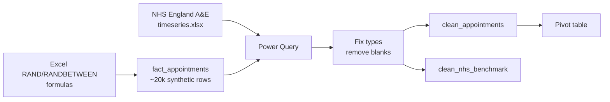

# Lab 01: Generating and Cleaning Hospital Operations Data in Excel

## Objectives

- **Part 1:** Generate a synthetic appointment dataset in Excel, at hospital scale
- **Part 2:** Download and clean the real NHS England trust-level benchmark file
- **Part 3:** Fix data types and resolve obvious quality problems in the synthetic data
- **Part 4:** Produce a first pivot table answering a real question

## Background / Scenario

A fictional hospital (call it **Fictional NHS-style Trust**, a name
invented for this series and not a real trust) wants to know which
department has the worst no-show rate and where patients wait longest. No
one has built anything to answer that; appointment data sits in whatever
system scheduled it, and nobody has pulled it into one place.

Before touching any of that, one scoping decision needs to be explicit,
because it shapes every lab that follows: **this BI team is scoped out of
clinical data by policy.** No diagnosis codes, no treatment records, no
patient names, no NHS numbers, nothing that identifies an individual or
what was wrong with them. The brief is operations only: did the
appointment happen, how late, which department, how busy was the place.
That's a real and common split in hospital BI teams: clinical data has its
own governance, its own systems, and usually its own analysts. Scheduling
and throughput data is a different, lower-sensitivity problem, and it's
the one this series solves.

This lab is the same first step as any series in this collection: get raw
data into a shape a human can read, using only Excel and Power Query. Here
there are two sources instead of one: synthetic row-level appointments
this lab builds from scratch, and a real published NHS statistics file
that grounds later labs against something that isn't made up.

## Required Resources

- Excel 2021 or later, or Microsoft 365
- Internet access, once, to download the real benchmark file: go to
  <https://www.england.nhs.uk/statistics/statistical-work-areas/ae-waiting-times-and-activity/>
  and download the latest **A&E Attendances and Emergency Admissions**
  monthly time series (published as an Excel workbook, OGL v3.0 licence,
  no login required). Save it as `ae-attendances-timeseries.xlsx`.
- No other internet access is needed: the appointment data is generated
  locally in this lab
- Approximately 2.5 hours

## Topology



---

## Part 1: Generate the Synthetic Appointment Data

### Step 1: Set up the column structure

In a new sheet named `raw_appointments`, create headers: `appointment_id`,
`department`, `scheduled_time`, `actual_time`, `status`, `wait_minutes`.

### Step 2: Build a department list to draw from

In a small side table, list six departments: `Emergency`, `Outpatients`,
`Radiology`, `Cardiology`, `Orthopaedics`, `General Surgery`. Nothing
clinical is stored per appointment beyond this label: no diagnosis, no
reason for visit.

### Step 3: Generate appointment IDs and departments

Row 2 down to row 20001:

```
appointment_id:  =TEXT(ROW()-1,"APT00000")
department:      =INDEX($K$2:$K$7, RANDBETWEEN(1,6))
```

### Step 4: Generate scheduled and actual times

```
scheduled_time:  =DATE(2025,1,1) + RANDBETWEEN(0,364) + TIME(RANDBETWEEN(8,17),RANDBETWEEN(0,59),0)
status:          =IF(RAND()<0.12,"no-show",IF(RAND()<0.08,"cancelled","attended"))
actual_time:     =IF(D2="attended", C2 + (RANDBETWEEN(-5,45)/1440), "")
```

`status` is evaluated before `actual_time` so a no-show or cancellation can
correctly leave `actual_time` blank. Nobody arrives late to an appointment
they never attended.

> **Why RAND() thresholds instead of a fixed count per status.** Hard-coding
> "2,400 no-shows exactly" would produce a suspiciously uniform dataset:
> every department would show close to the same no-show rate by
> construction, defeating the entire point of Lab 01's question. Random
> thresholds per row let some departments drift higher and lower by chance,
> the way a real no-show rate actually would.

<details>
<summary>Hint</summary>

If every row shows the same `department`, the `INDEX`/`RANDBETWEEN` pair
is probably referencing a single cell instead of the `$K$2:$K$7` range.
Check the dollar signs are anchoring the range, not the row.

</details>

### Step 5: Calculate wait_minutes

```
wait_minutes: =IF(D2="attended", ROUND((E2-C2)*1440,0), "")
```

### Step 6: Convert formulas to values

Select the full range, then **Copy**, then **Paste Special → Values**. Formulas
recalculating on every keystroke across 20,000 rows makes Excel sluggish,
and Power Query in Part 3 needs stable values, not volatile `RAND()` cells
that change on every open.

<details>
<summary>Hint</summary>

If a formula bar still shows `=IF(...)` after pasting, you pasted normally
instead of using Paste Special → Values. Undo, reselect the range, and use
Paste Special again (Ctrl+Shift+V is the shortcut on Windows).

</details>

<details>
<summary>Expected result, Part 1</summary>

Roughly 20,000 rows. About 12% `no-show`, about 8% `cancelled`, the rest
`attended` with a `wait_minutes` value between roughly -5 and 45 (the
`RANDBETWEEN(-5,45)` range from Step 4; a negative value means the patient
was seen slightly early, not a data error). Six distinct values in
`department`, roughly even in count. `actual_time` and `wait_minutes` are
blank for every `no-show` and `cancelled` row.

</details>

---

## Part 2: Import and Clean the Real NHS Benchmark

### Step 1: Open the downloaded workbook

Open `ae-attendances-timeseries.xlsx`. NHS England publishes this with a
cover sheet, a notes sheet, and the actual data sheet a few tabs in,
usually named something like `Activity` or `Time series`. Find the sheet
with one row per month and columns for total attendances, emergency
admissions, and the percentage seen within four hours.

### Step 2: Check what you actually have

| Column | Expected type | What to check |
|---|---|---|
| Period / Month | Date or text | Consistent format across all rows? |
| Total attendances | Number | Any blank rows for months not yet published? |
| Attendances over 4 hours | Number | Present for every month? |
| % in 4 hours or less | Percentage | Stored as a decimal or as text with a % sign? |
| Emergency admissions | Number | Consistent column position across sheet versions? |

> **National statistics files are clean in a different way than they're
> useful.** NHS England's export won't have duplicate rows or garbled
> encoding, but it will have footnote markers stuck to numbers, blank
> rows between sections, and a header that spans two merged cells. "Clean"
> and "ready to load" are not the same thing.

### Step 3: Note the grain mismatch now

This file is **one row per month, for the whole trust or region**, not
one row per attendance. That's a completely different grain from the
20,000-row appointment file built in Part 1. Nothing to fix yet; this is
the fact this lab's design has to respect, and it's why Lab 04 uses this
file for benchmarking rather than blending it row-for-row into
`fact_appointments`.

<details>
<summary>Expected result, Part 2</summary>

One row per calendar month, going back several years. A percentage column
for attendances seen within four hours, sitting somewhere in the
high-80s to mid-90s for most recent months. NHS England's published
national 4-hour performance has been below the 95% constitutional standard
for years, so don't be surprised if your downloaded file shows that.

</details>

---

## Part 3: Fix Types and Resolve Quality Problems

### Step 1: Send both tables to Power Query

`raw_appointments` → **Data → From Table/Range**. Repeat for the NHS sheet
(select the actual data range, not the cover sheet).

### Step 2: Set explicit data types on the appointment data

- `scheduled_time` → Date/Time
- `actual_time` → Date/Time (blanks stay blank, don't fill them)
- `wait_minutes` → Whole Number
- `status` → Text

### Step 3: Find the actual problem

Group `raw_appointments` by `department`, count rows per group.

<details>
<summary>Hint</summary>

**Transform → Group By**, group on `department`, count rows. Sort the
result descending by count and look at the bottom of the list, not the
top: a stray duplicate label shows up as a small group, not a missing
one.

</details>

**Expected result:** roughly even counts across six departments, but if
you generated the department list twice or fat-fingered a label, you may
see a seventh, near-empty group, like `"Radiology "` with a trailing space
sitting apart from `"Radiology"`. Text.Trim the `department` column now.

> **Why check before pivoting.** A no-show rate computed on data with a
> stray duplicate category will quietly split one department's numbers
> into two rows in every pivot from here on. Catching it here costs one
> `Text.Trim` step. Catching it after Lab 02's model is built costs a
> rebuild.

### Step 4: Clean the NHS benchmark table

Remove the cover-sheet and notes rows (**Remove Top Rows**, or filter out
rows where the month column doesn't parse as a date). Rename the query
`clean_nhs_benchmark`. Set the percentage column's type explicitly:
Power Query sometimes imports "95.2%" as text rather than a number if the
source cell was formatted unusually.

<details>
<summary>Hint</summary>

If filtering on "month column parses as a date" removes every row, the
column is still typed as text. Set its type to Date first, then filter.
Power Query evaluates the column's declared type, not what the text looks
like.

</details>

### Step 5: Close and load both

`raw_appointments` → rename `clean_appointments` → **Close & Load To →
Table**. Do the same for `clean_nhs_benchmark`.

<details>
<summary>Expected result, Part 3</summary>

`clean_appointments` loads with exactly six distinct department values and
roughly 20,000 rows (fewer only if you removed the seventh, mistyped group
rather than fixing it in place). `clean_nhs_benchmark` loads with no blank
rows and a percentage column that sorts and filters numerically, not as
text. Check this by trying to filter it to "greater than 90%"; if that
filter option isn't available, the type is still wrong.

</details>

---

## Part 4: A First Pivot Table

### Step 1: Build the pivot

From `clean_appointments`: rows = `department`, values = count of
`appointment_id`, and a second value = count of `appointment_id` filtered
to `status = "no-show"`.

The cleanest way in a plain pivot: add `status` as a column field instead,
so each department row shows counts split by `attended` / `no-show` /
`cancelled` side by side.

### Step 2: Add a no-show rate column manually

Outside the pivot, in an adjacent column:

```
=GETPIVOTDATA("appointment_id",$A$3,"department","Emergency","status","no-show")
 / GETPIVOTDATA("appointment_id",$A$3,"department","Emergency")
```

Repeat per department, or accept doing this by hand for six rows. It's
exactly the kind of repetitive, error-prone step Lab 02 replaces with one
DAX measure.

<details>
<summary>Hint</summary>

`GETPIVOTDATA` references break if the pivot table's layout changes after
you write the formula (a field moved, a filter added). If a cell shows
`#REF!`, click into the pivot once to confirm the field names in your
formula still match what's actually in the rows/columns.

</details>

### Step 3: Answer the question this lab set out to answer

Which department has the highest no-show rate? Sort the manual rate
column descending.

**Expected result:** with random thresholds per row, one or two
departments will sit visibly above the rest by chance. Note which one,
because Lab 02 recomputes this properly and it's worth checking the
numbers agree.

<details>
<summary>Expected result, Part 4</summary>

Six no-show rates, each somewhere close to 12% (the `RAND()<0.12` threshold
from Part 1), scattered by a couple of percentage points either side
purely from randomness across roughly 3,300 rows per department. No
department should be wildly off this range: if one shows above 20% or
below 5%, recheck that the `status` formula from Part 1 Step 4 was pasted
as values correctly and isn't still recalculating.

</details>

---

## Troubleshooting

| Symptom | Cause | Fix |
|---|---|---|
| wait_minutes shows negative numbers | actual_time formula ran before status was fixed to values, so a stale RAND() reordered rows | Regenerate Part 1 Step 4–5 in order, then paste as values immediately |
| A department count looks abnormally low | Trailing space or case mismatch splitting one department into two labels | Text.Trim and Text.Lower/Proper the department column in Power Query |
| NHS file won't load past row 1 | Selected the cover sheet, not the data sheet | Re-check the workbook's tab list for the actual time series sheet |
| Percentage column shows as 0 or 1 for every row | % in 4 hours imported as whole number instead of percentage | Set the column type explicitly to Percentage, don't rely on Detect Data Type |

---

## Reflection

1. What no-show rate did the highest department show, and is the
   difference from the lowest department large enough to be a real
   operational signal, or small enough to be noise from the random
   generation?
2. Why does the NHS benchmark file sit at a different grain than
   `fact_appointments`, and what problem would blending them into one flat
   table right now cause?
3. If a real trust's scheduling system exported this file monthly, which
   Part 3 checks would need to run every time, not just once?

---

## What Went Wrong When I Did This

- **Left the RAND()-based formulas live** when I first tried to sort the
  pivot in Part 4. Every sort reshuffled the underlying no-show flags
  because RAND() recalculates on any sheet action, not just on entry. The
  "highest no-show department" changed every time I clicked something. Had
  to go back to Part 1 Step 6 and paste-as-values before doing anything
  else.
- **Downloaded the wrong NHS file on the first pass.** The England-level
  summary page links to several different time series (attendances,
  admissions, ambulance handover), and I grabbed the wrong one, which had
  no department-shaped breakdown at all. Had to reread what Lab 04 actually
  needed (trust-level 4-hour performance over time) before re-downloading
  the correct series.
- **Assumed `department` was clean** and built the first pivot straight
  from `raw_appointments` without running the Part 3 Step 3 group-by
  check. A trailing space on about 40 rows of `"Radiology "` sat as a
  seventh near-invisible row at the bottom of the pivot until I scrolled
  past the visible departments and noticed it.

---

## Where This Breaks

- No-show rate required a manual `GETPIVOTDATA` formula per department:
  correct, but it doesn't recalculate cleanly if a slicer or filter gets
  added
- `clean_appointments` and `clean_nhs_benchmark` are separate, unrelated
  tables: nothing connects a department's synthetic wait time to the
  trust's real published 4-hour performance
- The department list was typed once, by hand, with no protection against
  a department being renamed or restructured later, which is exactly
  what happens by the start of Lab 02

**Next:** [Lab 02: Building a Power BI Data Model](02-data-model.md)
