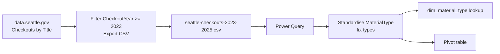

# Lab 01: Cleaning Seattle Library Checkout Data in Excel

## Objectives

- **Part 1:** Download a filtered slice of the Seattle Public Library
  checkouts dataset and assess data quality
- **Part 2:** Fix data types and standardise the messy `MaterialType` column
- **Part 3:** Build a lookup table for material types
- **Part 4:** Produce a first pivot table answering a real question

## Background / Scenario

Seattle Public Library publishes every title's monthly checkout count going
back to April 2005: physical books, ebooks, audiobooks, everything the
system tracks, aggregated by title and month rather than by borrower. It is
public, free, and enormous: the full history runs into tens of millions of
rows.

Nobody at a branch is going to open that file directly. This lab is the same
first step as any of these five series: pull a reasonable slice of a real
export, get it into a shape a human can read, using only Excel and Power
Query.

## Required Resources

- Excel 2021 or later, or Microsoft 365
- Internet access to download the source data
- **Seattle Public Library, Checkouts by Title**, City of Seattle Open Data
  Portal: <https://data.seattle.gov/Community/Checkouts-by-Title/tmmm-ytt6>
  (mirrored on data.gov at
  <https://catalog.data.gov/dataset/checkouts-by-title>). Public dataset, no
  login required.
- Approximately 2 hours

### Getting a workable file

The full dataset is multiple gigabytes and Excel will not open it happily.
On the Socrata data portal page, use **Filter** (top of the table view) to
add a condition: `CheckoutYear` is at least `2023`. Then **Export → CSV**.
That keeps the download to a few hundred thousand rows instead of tens of
millions, and the filter step is exactly the kind of thing worth writing
down in your own notes, because you'll want to repeat it in Lab 03 when the
question of refresh comes up.

If the portal's export times out on a filtered request that large, drop the
filter to `CheckoutYear >= 2024` instead: one year is still enough data to
show every pattern this series needs.

Save the download as `data/seattle-checkouts-2023-2025.csv`.

## Topology

---

## Part 1: Import and Assess

### Step 1: Load the CSV

**Data → Get Data → From Text/CSV** → `seattle-checkouts-2023-2025.csv`.
Load it as a table first, not straight into Power Query. Look at it raw
before touching anything.

### Step 2: Check the columns you actually have

| Column | Expected type | What to check |
|---|---|---|
| UsageClass | Text | How many distinct values (should be small) |
| CheckoutType | Text | Physical vs. digital checkout systems |
| MaterialType | Text | How many distinct *spellings* (this is the problem column) |
| CheckoutYear | Number | Matches the filter you applied? |
| CheckoutMonth | Number | 1–12 only? |
| Checkouts | Number | Any zero or negative values? |
| Title | Text | Any rows with extra junk jammed into the field? |
| Creator | Text | How many blank? |
| Subjects | Text | How many blank? |
| Publisher | Text | How many blank? |
| PublicationYear | Text | This column ships as text in the source, not a number |

Use **Data → Data Validation** or a quick `COUNTIF` to spot-check each
column before trusting any of it.

> **Why check before cleaning.** A pivot table built on data you have not
> looked at will produce a number that is wrong in a way you cannot see.
> It will just look like an answer. This dataset in particular rewards
> checking first: it's real, it's messy, and none of the mess announces
> itself.

Hint

`ISBN` is worth a look too even though it isn't in the table above. Check
`COUNTBLANK` on it against a row filtered to an early `CheckoutYear` versus
a recent one. The blank rate is not constant across the file, and that's
worth knowing before Lab 06.

### Step 3: Find the actual problems

Count distinct values in `MaterialType`:
`=SUMPRODUCT(1/COUNTIF(MaterialType_range,MaterialType_range))`.

Hint

If the range reference is wrong this formula returns 1 or an error rather
than a sensible count. Select the actual column of data, not the header,
and make sure the same range appears on both sides of the `COUNTIF`.

**Expected result:** more distinct values than there are real material
types. The source data mixes casing and formatting inconsistently, and
you'll see entries like `BOOK`, `Book`, and `book` sitting as separate values, and
similarly for audiobooks and video formats. None of this is a data entry
error in the traditional sense; it's what 20 years of a library catalogue
system exporting through different code paths looks like.

Check `Subjects` for blanks: `=COUNTBLANK(Subjects_range)`.

**Expected result:** a meaningful share of rows, often close to a third,
have no `Subjects` value at all. Older catalogue records and some digital
formats were never tagged.

Scan `Title` for entries containing a `/` or a `;` partway through, for
example `"Some Book Title / a novel"` or `"Series Name ; book 3"`. The
Title field sometimes carries subtitle or series information jammed in with
the main title rather than in a separate field.

Hint

**Data → Text Filters → Contains** on the `Title` column, filtered to `/`,
gives you a quick visual count without writing a formula. Repeat for `;`.
Sort the filtered results alphabetically and the pattern jumps out fast.

> **None of these three problems is a bug you fix by deleting rows.** A
> blank `Subjects` value is a real fact about that catalogue record, not
> missing data to be imputed. `MaterialType` casing is a formatting
> inconsistency you *can* fix safely. The Title field's jammed-in subtitle
> is somewhere in between: worth normalising for display, but the raw
> value is still the source of truth if you need to match back to the
> original record.

Expected result, Part 1

Row count for a `CheckoutYear >= 2023` filter runs into the hundreds of
thousands, not millions. `MaterialType` shows more than a dozen distinct
spellings before cleanup, more than the true number of formats. `Subjects`
blank rate sits close to a third. `ISBN` blank rate is low for recent rows
and much higher the further back you sample, because Seattle added the
field to this dataset partway through its history and never backfilled
older records. Sorting the `/`-filtered `Title` view should surface at
least one well-known, high-volume title split across two or three spelling
variants.

---

## Part 2: Fix Types and Standardise MaterialType

### Step 1: Send the table to Power Query

Select the table → **Data → From Table/Range**.

### Step 2: Set explicit data types

Power Query guesses types from a sample of rows, and a guess made on the
first 1,000 rows can be wrong for row 200,000. Set each column's type
explicitly rather than trusting **Detect Data Type**:

- `CheckoutYear` → Whole Number
- `CheckoutMonth` → Whole Number
- `Checkouts` → Whole Number
- `PublicationYear` → stays Text. It's genuinely inconsistent in the
  source (some rows carry a range like `"1998-1999"`, some carry `"c1987"`)
  and forcing it to a number will null out exactly the rows worth
  investigating later

### Step 3: Standardise MaterialType

**Transform → Format → lowercase**, then **Transform → Format → Capitalize
Each Word**, applied to `MaterialType`. This collapses `BOOK` / `Book` /
`book` down to one spelling.

> **Fixing casing is not the same as fixing meaning.** `Capitalize Each
> Word` makes `BOOK` and `book` collapse into the same value. It does
> nothing for two values that mean the same thing but are spelled
> differently on purpose in the source, like `"EBOOK"` and `"E-Book"`.
> Check the distinct value count again after this step; if it's still
> higher than expected, there's a second pass needed, and Lab 02's
> dimension table is where that gets handled properly rather than patched
> here row by row.

### Step 4: Re-count distinct MaterialType values

Same distinct-count formula as Part 1, run against the cleaned column.

**Expected result:** the count drops noticeably (casing was doing most of
the damage), but doesn't necessarily land on the "true" number of material
types yet. Note the remaining count; it matters in Lab 02.

### Step 5: Close and load

**Close & Load To → Table**, into a sheet named `clean_checkouts`.

Expected result, Part 2

The distinct `MaterialType` count after Step 3 should be noticeably lower
than Part 1's raw count, typically cut by a third to a half, but still
above the true number of formats. `CheckoutYear` and `CheckoutMonth` load
as whole numbers with no errors. `PublicationYear` still shows text values
like `"1998-1999"` and `"c1987"` sitting alongside plain four-digit years
in the same column. That's expected, not a failed conversion.

---

## Part 3: Build the Material Type Lookup

### Step 1: Extract distinct material types

Reference the `clean_checkouts` query (right-click → **Reference**, not
**Duplicate** (a fix made upstream in `clean_checkouts` should flow
through automatically, not require redoing a separate copy).

Keep only `MaterialType`. **Remove Duplicates**.

**Expected result:** a short list, roughly a dozen or fewer rows: book,
ebook, audiobook, video, music CD, and similar physical/digital formats.

### Step 2: Check for a specific problem: near-duplicate spellings

Sort the list alphabetically and read down it by eye. Watch for pairs that
are clearly the same format under two spellings: `"Audiobook"` next to
`"Audio Book"`, or `"Videodisc"` next to `"Video Disc"`.

**Troubleshooting:** if you find pairs like this, note them but don't merge
them here yet. Part 2's cleaning only fixed casing, not wording. A proper
merge belongs in Lab 02's dimension table, where it can be done once and
tied to every fact row correctly, rather than as an ad hoc find-and-replace
in this lookup.

### Step 3: Name and load

Rename the query `dim_material_type`. **Close & Load To → Table**.

Expected result, Part 3

`dim_material_type` lands somewhere around a dozen rows, not many more.
Write down every near-duplicate pair you spotted in Step 2, with the exact
spelling of each, before moving on. Lab 02 Part 3 asks you to finish this
merge and it goes faster if you already have the list.

---

## Part 4: A First Pivot Table

### Step 1: Build the pivot

From `clean_checkouts`: rows = `MaterialType`, values = `Checkouts` (Sum).

### Step 2: Sort and answer the question this lab set out to answer

Sort descending by the `Checkouts` sum.

Expected result

Which `MaterialType` had the most checkouts is what you're after here, and
Seattle's overall lending mix runs heavily digital system-wide (physical
print sat under a third of total checkouts by 2024). That citywide
split doesn't automatically apply to your own filtered pivot at this
`MaterialType` grain. Read what your pivot actually shows rather than
assuming the system-wide pattern holds for one slice.

### Step 3: Add a second dimension

Drag `UsageClass` under `MaterialType` as a second row level.

Hint

If a `MaterialType` you expected to be purely physical (or purely digital)
shows rows under both `UsageClass` values, that's not a pivot error. Some
formats genuinely span both, which is exactly the overlap worth noticing
before Lab 02 builds a dimension table around these two fields.

**Expected result:** a breakdown of each material type by physical vs.
digital usage class, which starts to reveal that `MaterialType` and
`UsageClass` overlap in ways that aren't fully redundant. An ebook is
always digital `UsageClass`, but a `MaterialType` of "Book" can appear
under both, which is worth noticing now.

### Step 4: Ask the question the pivot can't answer

Which *title* had the most checkouts in the filtered period? Type
`Title` in as a third row level under `MaterialType` and see how far you
get.

**Expected result:** it technically works, but it's slow, the pane is
enormous, and the near-duplicate title spellings flagged in Part 1 mean the
same book is very likely splitting its checkout count across two or three
rows instead of one. That fragmentation is the gap Lab 02 exists to close.

Expected result, Part 4

The MaterialType-level sort in Step 2 should show one format with a clear,
non-marginal lead over the rest, not a near-tie. Once `Title` is added as a
third level in Step 4, look up the same well-known title you flagged as
split in Part 1: it should appear as two or three separate rows here, each
with a smaller count, none of which is the title's true total.

---

## Troubleshooting

| Symptom | Cause | Fix |
|---|---|---|
| MaterialType still shows many distinct values after Part 2 Step 3 | Casing fixed but wording still differs (e.g. "Audio Book" vs. "Audiobook") | Note the pairs for Lab 02; don't hand-merge here |
| Checkouts sum looks too low overall | CSV export from the portal was interrupted or the filter reset before export | Re-download, confirm CheckoutYear filter applied before clicking Export |
| PublicationYear column errors when set to Number | Source values include ranges and "c" prefixes, not clean years | Leave PublicationYear as Text |
| Pivot by Title is unusably slow | Too many distinct titles in a flat pivot | Expected at this stage: this is the reason Lab 02 builds a proper dim_title |

---

## Reflection

1. How many distinct `MaterialType` values did the raw export contain,
   versus after standardising casing? What does the gap tell you about how
   the source system produces this field?
2. Which material type actually won on checkouts in your filtered period?
   Does it match what you expected before opening the file?
3. If you filtered to a different year range, would you expect the winner
   to change? Why might a library's digital checkout share grow year over
   year even if this particular pivot doesn't show it yet?

---

## What Went Wrong When I Did This

- **Tried to export the full unfiltered dataset first**, out of curiosity
  about the true row count. The portal's export queued for several minutes
  and then failed outright. Applied the `CheckoutYear >= 2023` filter
  before exporting and it came back in under a minute.
- **Ran Capitalize Each Word before checking what it would do to acronyms**
  in `MaterialType`. A couple of entries like `"DVD"` came out as `"Dvd"`,
  which reads oddly but is at least consistent, so I let it stand rather
  than special-casing it. Worth knowing this step isn't perfectly
  semantic, just consistent.
- **Assumed the near-duplicate title problem was rare** and almost skipped
  checking for it, until the Part 4 Step 4 pivot by Title showed the same
  well-known title appearing as three separate rows with three different
  checkout counts, none of them the true total. That's what sent me
  looking for it deliberately instead of noticing it by accident.

---

## Where This Breaks

- `MaterialType` casing is fixed but near-duplicate wording (Audiobook vs.
  Audio Book) is only flagged, not resolved
- The same title can appear under slightly different spellings across
  rows, meaning a naive count by Title undercounts or fragments a popular
  title's true checkout total
- Every new question is a new pivot, built from scratch, and a
  Title-by-MaterialType pivot is already too slow to be usable

**Next:** [Lab 02: Building a Power BI Data Model](02-data-model.md)
