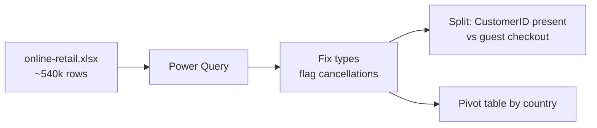

# Lab 01: Cleaning Online Retail Data in Excel

## Objectives

- **Part 1:** Download the real UCI Online Retail dataset and assess data quality
- **Part 2:** Fix data types and isolate the messy rows instead of deleting them blindly
- **Part 3:** Handle missing CustomerID as a real feature of the data, not a bug
- **Part 4:** Produce a first pivot table answering a real question

## Background / Scenario

A UK-based online retailer that sells mostly giftware has a year of order
history sitting in a single export: every invoice line, every product,
every country it shipped to, all in one flat file. Nobody has pulled
revenue by country yet, and the export includes cancelled orders mixed in
with real sales, which makes even that simple a question wrong if you
answer it carelessly.

This is the same first step as the other four series in this set: get the
raw export into a shape a human can actually read, using only Excel and
Power Query, before anything gets near Power BI.

## Required Resources

- Excel 2021 or later, or Microsoft 365
- `data/online-retail.xlsx`, the [Online Retail
  dataset](https://archive.ics.uci.edu/dataset/352/online+retail), UCI
  Machine Learning Repository, CC BY 4.0 license. No account needed to
  download.
- Approximately 2.5 hours

## Topology



---

## Part 1: Download and Assess

### Step 1: Get the file

Download `online-retail.xlsx` from the UCI page linked above: it's the
Excel workbook, not a database dump, so it opens directly. One sheet,
roughly 540,000 rows, covering December 2010 to December 2011.

### Step 2: Look at the columns before touching anything

| Column | Expected type | What to check |
|---|---|---|
| InvoiceNo | Text | Does it ever start with "C"? |
| StockCode | Text | Mixed letters and numbers, don't let Excel coerce it to a number |
| Description | Text | Any blanks? Any non-product text? |
| Quantity | Number | Any zero or negative values? |
| InvoiceDate | Date/time | Consistent format across the whole range? |
| UnitPrice | Currency | Any zero or negative values? |
| CustomerID | Number | How many blanks, as a percentage of rows? |
| Country | Text | How many distinct values? |

Open a scratch area and run a few `COUNTIF`/`COUNTBLANK` checks on each
column before building anything on top of it.

> **Why check before cleaning.** A pivot table built on data you haven't
> looked at produces a number that's wrong in a way you can't see: it just
> looks like an answer. This dataset has at least four separate quality
> issues layered on top of each other, and fixing them in the wrong order
> hides the ones underneath.

<details>
<summary>Hint</summary>

Start with `COUNTBLANK` on `CustomerID` and `Description`. Blanks are the
cheapest thing to find. Then use `COUNTIF` with a wildcard (`"C*"`) on
`InvoiceNo` to get a rough sense of how many rows might be cancellations
before you filter properly in Step 3.

</details>

### Step 3: Find the cancellation signal

Filter `InvoiceNo` to text starting with "C". These are cancellations:
every row with a "C" prefix also has a negative `Quantity`, and it's a real
usable signal, not something you need to fabricate.

**Expected result:** roughly 3-4% of rows are cancellations. `Quantity` on
these rows is negative and mirrors an original order elsewhere in the file
(same `StockCode`, opposite sign, usually close in date).

### Step 4: Find the other three problems

- **Blank or junk `Description`.** Filter to blank, then search the
  distinct list of descriptions for entries like "check", "damages",
  "wrongly marked", "sold as set": these are internal notes that leaked
  into a product field, not products.
- **Zero or negative `UnitPrice`** on rows that aren't cancellations. These
  are mostly stock adjustments or write-offs recorded through the same
  export, not real sales at that price.
- **Blank `CustomerID`.** Count it as a percentage of total rows before
  deciding anything about it, don't skip to Part 3 yet.

<details>
<summary>Hint</summary>

Filter `Description` to blank first, then separately filter it to text
containing "?" or all-caps single words like "DAMAGES". The junk entries
tend to cluster in one of those two patterns, not spread evenly through the
column.

</details>

**Troubleshooting:** if `COUNTBLANK` on `CustomerID` returns zero, the
column probably imported with blanks converted to `0` rather than a true
empty cell. Re-check the import: Power Query's type detection sometimes
does this to a numeric column with gaps.

<details>
<summary>Expected result, Part 1</summary>

Total rows land close to 540,000. Cancellations (InvoiceNo starting "C")
are roughly 3-4% of rows. Blank or junk Description rows are a small
fraction, well under 1%, but they carry real Quantity and UnitPrice values.
Zero/negative UnitPrice on non-cancellation rows is a similarly small
fraction. Blank CustomerID sits far higher, around a quarter of all rows.
That gap is large enough that it can't be an accident or a data-entry
error; it means something structural about how this retailer's checkout
works, which Part 3 gets into.

</details>

---

## Part 2: Fix Types and Flag, Don't Delete

### Step 1: Send the table to Power Query

Select the full range → **Data → From Table/Range**.

### Step 2: Set explicit data types

Power Query samples the first 1,000 rows to guess a column's type, and a
guess made on that sample can be wrong for row 300,000. Set these
explicitly instead of trusting **Detect Data Type**:

- `InvoiceNo` → Text (not Whole Number: the "C" prefix will otherwise
  throw an error or silently null out every cancellation row)
- `StockCode` → Text
- `InvoiceDate` → Date/Time
- `UnitPrice` → Currency/Decimal
- `Quantity` → Whole Number
- `CustomerID` → Whole Number, but only after confirming Step 4 above
  didn't already turn blanks into zeros

### Step 3: Add a cancellation flag, don't filter cancellations out yet

**Add Column → Custom Column**:

```
IsCancellation = if Text.StartsWith([InvoiceNo], "C") then true else false
```

> **Flag it, don't remove it.** The instinct on seeing "C" prefixes and
> negative quantities is to filter them out so revenue totals look clean.
> That throws away the only real signal this dataset has for returns rate,
> which Lab 03's dashboard needs. Keep every row; let downstream measures
> decide what to include.

### Step 4: Add a revenue column

```
LineRevenue = [Quantity] * [UnitPrice]
```

This will be negative on cancellation rows by construction: that's
correct, not a bug. A plain `SUM` of this column already nets cancellations
against original orders, which is one reason Part 4's pivot works without
extra filtering.

### Step 5: Close and load

**Close & Load To → Table**, into a sheet named `clean_orders`.

<details>
<summary>Expected result, Part 2</summary>

`clean_orders` has the same row count as the raw import. Nothing got
filtered out in this part, only typed and flagged. `IsCancellation` is
`TRUE` on the same ~3-4% of rows identified in Part 1. `LineRevenue` is
negative on every cancellation row and positive everywhere else. Summing
`LineRevenue` for a single `StockCode` that appears in both a normal order
and a cancellation should net close to zero if the cancellation reversed
that exact order.

</details>

---

## Part 3: CustomerID and Guest Checkouts

### Step 1: Quantify the gap

Reference `clean_orders` (right-click → **Reference**, not **Duplicate**:
a fix made upstream in `clean_orders` should flow through this query, not
require redoing a copy). Count blank `CustomerID` rows against the total.

**Expected result:** roughly a quarter of rows have no `CustomerID`.

### Step 2: Don't just filter them out

> **A blank CustomerID here isn't dirty data, it's a guest checkout.**
> This retailer's export doesn't assign an ID when someone orders without
> an account. Filtering those rows out to make the customer dimension
> "clean" silently deletes a real quarter of revenue from every
> customer-level analysis, while leaving it in every country- or
> product-level one. That's an inconsistency later labs will trip over if
> it isn't decided here, on purpose, in the open.

### Step 3: Decide the rule and write it down

For this lab, the rule is: guest-checkout rows stay in `fact_orders` for
Lab 02, with `CustomerID` mapped to a single "Guest" placeholder row in
`dim_customer` rather than dropped. Any measure that reports by customer
undercounts guests as one bucket; any measure that reports by country or
product is unaffected. Note this rule somewhere in the workbook: Lab 02
builds the dimension table on it directly.

### Step 4: Load the flagged table

**Close & Load To → Table**, sheet named `orders_with_flags`.

<details>
<summary>Expected result, Part 3</summary>

Blank `CustomerID` sits at roughly a quarter of rows, matching Part 1's
count. After this step every row still has a value in the `CustomerID`
column, either a real ID or the "Guest" placeholder, so a later
`COUNTBLANK` on this column in `orders_with_flags` should return zero even
though the underlying gap hasn't actually gone anywhere.

</details>

---

## Part 4: A First Pivot Table

### Step 1: Build the pivot

From `orders_with_flags`: rows = `Country`, values = `LineRevenue` (Sum).

### Step 2: Exclude cancellations from this specific question

The question is "which country generates the most revenue," which usually
means completed sales, not the net-of-returns number. Add `IsCancellation`
as a filter, set to `FALSE`.

**Expected result:** the United Kingdom dominates by a wide margin. This
retailer's customer base is mostly domestic, with a long tail of smaller
European markets.

### Step 3: Compare against the net figure

Remove the `IsCancellation` filter and compare the total to Step 2's
filtered total. The difference is exactly the value of cancelled orders,
a sanity check that the flag in Part 2 is doing what it claims.

<details>
<summary>Hint</summary>

If the two totals come out identical, the filter didn't actually apply.
Check the pivot's field list rather than assuming the number is correct
because it looks plausible.

</details>

### Step 4: Answer the question this lab set out to answer

Which country generates the most revenue, cancellations excluded? Which
country has the highest cancellation rate *as a share of its own orders*,
not just in absolute terms?

The pivot answers the first cleanly. The second needs a ratio: total
cancelled revenue divided by that country's total order count, which a
plain pivot can approximate with two value fields but can't express as one
reusable number. That gap is why Lab 02 exists.

<details>
<summary>Expected result, Part 4</summary>

The United Kingdom leads on total revenue by a wide margin, commonly 80-90%
of the whole dataset, with the rest spread across Germany, France, EIRE,
and a long tail of smaller European markets. The all-cancellations total
should exceed the cancellations-excluded total by roughly the value of
Step 3's cancelled-revenue figure. The country with the highest
cancellation *rate* is not necessarily the UK. A smaller market with a
handful of large cancelled orders can post a higher rate than the UK's
much larger order volume dilutes down to.

</details>

---

## Troubleshooting

| Symptom | Cause | Fix |
|---|---|---|
| InvoiceNo column full of errors or blanks | Set to Whole Number, which can't hold "C" prefixed values | Re-check Part 2 Step 2, set InvoiceNo to Text |
| Revenue total for cancellations is positive | Quantity imported as text and summed as string concatenation, not arithmetic | Confirm Quantity is Whole Number before adding LineRevenue |
| CustomerID blank count is zero | Import converted blanks to 0 | Re-import, or replace 0 with null explicitly before setting the type |
| Country pivot total doesn't match a manual SUM | IsCancellation filter left on from a previous step without noticing | Check active filters on the pivot field list |

---

## Reflection

1. What fraction of rows are guest checkouts, and what would silently
   dropping them have cost the country-level pivot versus a customer-level
   one?
2. Why does netting cancellations against original orders in one `SUM`
   give a different answer than filtering cancellations out entirely, and
   which one answers "how much revenue did we keep"?
3. If next year's export arrives with the same four quality issues, how
   many of today's steps would you actually have to redo versus just
   re-run?

---

## What Went Wrong When I Did This

- **Set `InvoiceNo` to Whole Number** on the first pass, because most
  values look numeric. Every cancellation row (the ones starting with "C")
  came back as an error, and I didn't notice until the cancellation count
  in Part 1 Step 3 came back as zero, which was the tell that something
  upstream had already destroyed the signal.
- **Filtered out blank `CustomerID` rows** before building the country
  pivot in Part 4, on the assumption that a clean customer dimension
  mattered everywhere. The UK revenue total dropped by close to a quarter
  compared to a version with guest checkouts included, which made no sense
  for a question that has nothing to do with customer identity. Reworked
  Part 3 to keep guest rows in and only exclude them where the analysis is
  actually customer-scoped.
- **Deleted the "check" and "damages" description rows** instead of
  flagging them, on the theory that they weren't real products. Lab 02
  needed them back: those rows still carry real `Quantity` and
  `UnitPrice` values that belong in total revenue, just not in a clean
  product list. Had to re-import rather than recover them from a filtered
  view I'd already overwritten.

---

## Where This Breaks

The workbook answers today's two questions but not the next ones:

- Cancellation rate as a share of a country's own orders needs a ratio
  measure, not a second pivot value field
- The "Guest" placeholder is a single bucket: there's no way yet to see
  how guest-checkout revenue compares to identified-customer revenue as a
  trend over time
- `StockCode` hasn't been checked yet for the same `Description` appearing
  under multiple different text values, a problem Lab 02's product
  dimension runs straight into

**Next:** [Lab 02: Building a Power BI Data Model](02-data-model.md)
