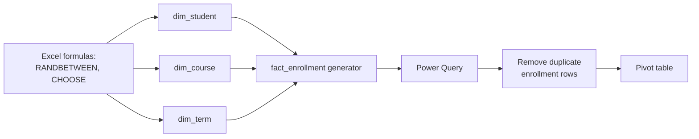

# Lab 01: Generating and Cleaning Synthetic University Data in Excel

## Objectives

- **Part 1:** Generate synthetic enrollment, course, and student data in Excel
- **Part 2:** Assess the generated data for the kind of mess a real export would have
- **Part 3:** Fix data types and build lookup tables
- **Part 4:** Produce a first pivot table answering a real question

## Background / Scenario

State University wants a Power BI report on course completion and library
usage by program. There's no real dataset to pull this from, and there
shouldn't be one for a training exercise: student records at this grain
(student ID, course, grade, enrollment date) are the kind of data FERPA
exists to protect in the US, and the UK/EU equivalent isn't any looser.
Nobody's downloading that, real or fake-but-identifiable, into a personal
project.

So this lab starts differently from the rest of this series: instead of
importing a file, the data is generated from scratch in Excel, using
formulas designed to produce realistic-looking, entirely synthetic records.
No real student, course, or institution appears anywhere in it.

## Required Resources

- Excel 2021 or later, or Microsoft 365
- No internet access needed: everything in this lab is generated locally,
  nothing is downloaded
- Approximately 2 hours

## Topology



---

## Part 1: Generate the Dimension Data

### Step 1: Decide what a student record needs, and what it must never need

Before writing a single formula, note that `dim_student` will hold `student_id`,
`program`, and `year_of_study`. That's it. No name, no date of birth, no
email, no contact detail of any kind.

> **This is a design decision, not a shortcut.** A real student information
> system has all of that, locked down under FERPA or UK GDPR with a named
> data controller. A training repo has no controller, no consent, no
> retention policy, and no business holding any of it. Leaving PII columns
> out entirely means there's no field to accidentally leak in a screenshot,
> a shared `.pbix`, or a GitHub commit. If a later lab seems to need a name
> to make a visual look realistic, the fix is a generic label like
> `Student 00412`, not a real-sounding one.

### Step 2: Generate dim_student

New sheet, `dim_student`. Header row: `student_id`, `program`,
`year_of_study`.

Row 2 down, 3,000 rows:

```
student_id:     ="S" & TEXT(ROW()-1, "00000")
program:        =CHOOSE(RANDBETWEEN(1,6), "Computer Science", "Biology",
                 "Business", "Nursing", "History", "Mechanical Engineering")
year_of_study:  =RANDBETWEEN(1,4)
```

Select all three formula cells for row 2, fill down to row 3001.

<details>
<summary>Hint</summary>

Fill down by selecting the row 2 range, then dragging the small square at
the bottom-right corner of the selection down to row 3001, or select the
full range first and use **Ctrl+D**. Typing the formula 3,000 times by
hand is not the intended method.

</details>

### Step 3: Freeze the random values

`RANDBETWEEN` and `CHOOSE` recalculate on every sheet edit, which means the
data changes under you the moment you touch anything else. Select the whole
`dim_student` range → **Copy** → **Paste Special → Values** over itself.
Now it's fixed data, not a live formula.

> **Paste-as-values before building anything downstream.** A fact table
> built by looking up against a dimension table that's still recalculating
> is a moving target: the same enrollment row can point at a different
> student on every F9 recalc. This bites people who skip straight to
> building the fact table and can't figure out why row counts change
> between saves.

<details>
<summary>Hint</summary>

**Paste Special → Values** (not a plain paste) is under **Home → Paste →
Paste Special**, or right-click after copying. A plain **Ctrl+V** leaves
the formulas in place and solves nothing.

</details>

<details>
<summary>Expected result, Part 1</summary>

`dim_student` has exactly 3,000 rows, `student_id` running S00001 through
S03000 with no gaps or repeats. `dim_course` has 150 rows, C001 through
C150. `dim_term` has exactly 3 rows, typed directly. None of the three
sheets recalculates when you click into an unrelated cell. If any of them
still does, Paste Special → Values was skipped somewhere.

</details>

### Step 4: Generate dim_course

New sheet, `dim_course`. 150 rows.

```
course_id:      ="C" & TEXT(ROW()-1, "000")
course_name:    =CHOOSE(RANDBETWEEN(1,10), "Intro Programming",
                 "Data Structures", "Cell Biology", "Organic Chemistry",
                 "Financial Accounting", "Marketing Principles",
                 "Fundamentals of Nursing", "Anatomy & Physiology",
                 "Modern World History", "Thermodynamics")
credits:        =CHOOSE(RANDBETWEEN(1,3), 3, 4, 5)
department:     =CHOOSE(RANDBETWEEN(1,6), "Computer Science", "Biology",
                 "Business", "Nursing", "History", "Mechanical Engineering")
```

Paste Special → Values, same as Step 3.

### Step 5: Generate dim_term

New sheet, `dim_term`, only 3 rows, typed directly rather than generated:
there's no benefit to randomising something this small.

| term_id | term_name | start_date | end_date |
|---|---|---|---|
| T1 | Fall 2024 | 2024-09-02 | 2024-12-13 |
| T2 | Spring 2025 | 2025-01-13 | 2025-05-02 |
| T3 | Fall 2025 | 2025-09-02 | 2025-12-12 |

---

## Part 2: Generate the Fact Tables

### Step 1: Generate fact_enrollment

New sheet, `fact_enrollment`. This is the big one, roughly 15,000 rows:
each row is one student taking one course in one term.

```
enrollment_id:      ="E" & TEXT(ROW()-1, "000000")
student_id:         ="S" & TEXT(RANDBETWEEN(1,3000), "00000")
course_id:          ="C" & TEXT(RANDBETWEEN(1,150), "000")
term_id:            =CHOOSE(RANDBETWEEN(1,3), "T1", "T2", "T3")
enrollment_date:    =RANDBETWEEN(DATE(2024,8,20), DATE(2025,9,10))
grade:              =CHOOSE(RANDBETWEEN(1,7), "A", "B", "C", "D", "F",
                     "W", "IP")
completion_status:  =IF(OR([@grade]="W", [@grade]="IP"), "Not Completed",
                     "Completed")
```

Fill down to 15,000 rows. Paste Special → Values.

<details>
<summary>Hint</summary>

`enrollment_id` uses six digits of padding where `dim_student` and
`dim_course` used five and three. Match the zero-padding width to the row
count so IDs sort and display consistently at 15,000 rows.

</details>

> **`RANDBETWEEN` on the join keys is what makes this realistic, and what
> creates the problem Lab 02 has to fix.** Two independent `RANDBETWEEN`
> calls can land on the same `student_id` + `course_id` + `term_id`
> combination more than once by chance, across 15,000 rows drawn from 3,000
> students and 150 courses. A real registrar's system would reject a
> student enrolling in the same course section twice in the same term. This
> generator doesn't know that rule, so it won't enforce it, which is
> exactly the kind of grain problem a real POS or SIS export produces for a
> different reason (a retried sync, a duplicate upload) but that shows up
> identically in the data: more than one fact row per key that should be
> unique.

### Step 2: Generate fact_library_visits

New sheet, `fact_library_visits`. Roughly 8,000 rows.

```
visit_id:         ="L" & TEXT(ROW()-1, "000000")
student_id:       ="S" & TEXT(RANDBETWEEN(1,3000), "00000")
resource_id:      ="R" & TEXT(RANDBETWEEN(1,400), "000")
checkout_date:    =RANDBETWEEN(DATE(2024,8,20), DATE(2025,9,10))
return_date:      =[@checkout_date] + RANDBETWEEN(1,21)
campus_location:  =CHOOSE(RANDBETWEEN(1,3), "Main Library", "Science Annex",
                   "Health Sciences Library")
```

Fill down to 8,000 rows. Paste Special → Values.

<details>
<summary>Hint</summary>

`resource_id` should draw from `RANDBETWEEN(1,400)`, not from whatever
range you used for `course_id` in the previous sheet. It's an easy formula
to copy-paste across sheets and forget to adjust the upper bound on.

</details>

<details>
<summary>Expected result, Part 2</summary>

`fact_enrollment` has 15,000 rows. `fact_library_visits` has 8,000 rows.
`return_date` is always after `checkout_date` by 1 to 21 days. If you spot
a row where they're equal, that's a valid edge case (RANDBETWEEN(1,21) can
return 1), not a bug. A distinct count on `resource_id` in
`fact_library_visits` should land close to 400, not a suspiciously round
number like 150.

</details>

---

## Part 3: Assess and Clean

### Step 1: Check for the duplicate enrollment problem

Add a helper column in `fact_enrollment`:

```
=COUNTIFS(student_id_range, [@student_id],
          course_id_range, [@course_id],
          term_id_range, [@term_id])
```

Filter for values greater than 1.

<details>
<summary>Hint</summary>

`COUNTIFS` needs the three range arguments to be the full columns
(`fact_enrollment[student_id]` and so on), not just the cells currently
visible after an earlier filter. A stale filter from an earlier check is
the usual reason this returns 1 for every row.

</details>

**Expected result:** a small but real number of students showing up twice
for the same course in the same term, a handful out of 15,000 rows, not
zero.

> **Why check now instead of trusting Lab 02 to catch it.** A pivot table
> built directly on `fact_enrollment` right now would silently double-count
> those students' completion outcomes. Finding it here, in Excel, before
> any DAX gets written, means the fix in Lab 02 is a deliberate decision
> about which duplicate to keep, not a mystery someone has to reverse
> engineer from a wrong-looking chart.

### Step 2: Set explicit data types

Send `fact_enrollment`, `fact_library_visits`, `dim_student`, `dim_course`,
and `dim_term` to Power Query (**Data → From Table/Range** on each). Set
types explicitly rather than trusting **Detect Data Type**:

- `enrollment_date`, `checkout_date`, `return_date`, `start_date`,
  `end_date` → Date
- `credits`, `year_of_study` → Whole Number
- Every `_id` column → Text (a leading letter makes this automatic, but
  confirm it: an ID column silently typed as a number will drop leading
  zeros the moment a filter is typed without them)

### Step 3: Close and load

**Close & Load To → Table**, one sheet per query, workbook saved as
`university-data.xlsx`.

<details>
<summary>Expected result, Part 3</summary>

The duplicate-check filter from Step 1 shows roughly a few dozen rows out
of 15,000 with a count greater than 1, under half a percent is typical,
zero would be suspicious given three independent RANDBETWEEN draws at this
volume. After Step 2, every `_id` column in every query shows as Text (ABC
icon in Power Query), and every date column shows as Date, not Whole
Number or Text.

</details>

---

## Part 4: A First Pivot Table

### Step 1: Build a lookup between fact_enrollment and dim_student

`fact_enrollment` doesn't carry `program` directly. Add a Power Query merge:
`fact_enrollment` → **Merge Queries** → `dim_student`, join on `student_id`,
keep `program`.

### Step 2: Build the pivot

Rows = `program`, Values = count of `enrollment_id`, and a second value =
count of `enrollment_id` filtered to `completion_status = "Completed"`.

### Step 3: Answer the question this lab set out to answer

Which program has the highest course completion rate? Divide the completed
count by the total count per program, by hand, in a column next to the
pivot. Excel's pivot tables don't do a clean percentage-of-row-total
across two separate value fields without a calculated field, and setting
one up correctly is fiddlier than it's worth for a one-off answer.

**Expected result:** completion rate varies by a few percentage points
across programs, not dramatic, but visible, and worth checking again once
Lab 02's duplicate fix changes the underlying counts slightly.

<details>
<summary>Expected result, Part 4</summary>

Six programs in the pivot, each with a completion rate somewhere in the
60-90% range (grades A through D count as completed, W and IP don't, drawn
uniformly across 7 grade options so roughly 5/7 of rows complete before any
per-program variation). No program should show 100% or 0%: either would
mean a filter or merge went wrong, not a genuine result.

</details>

---

## Troubleshooting

| Symptom | Cause | Fix |
|---|---|---|
| Data changes every time you click a cell | Formulas not converted to values | Redo Part 1 Step 3 / Part 2 Paste Special on every sheet |
| `student_id` in fact_enrollment doesn't match any row in dim_student | RANDBETWEEN range mismatch (fact table generated with a wider range than dim_student's row count) | Confirm both use RANDBETWEEN(1,3000) |
| Pivot completion rate looks impossibly uniform across programs | CHOOSE weighting on `grade` is genuinely uniform, this is expected, not a bug, for a first-pass generator | Note it in Reflection; a more realistic generator would weight grades unevenly, which is out of scope for this lab |
| COUNTIFS in Part 3 Step 1 returns 1 for every row | Helper column referencing the wrong range, or referencing itself | Confirm the three COUNTIFS ranges are the full columns, not just the visible/filtered rows |

---

## Reflection

1. How many duplicate student/course/term combinations did the generator
   produce, and as a fraction of 15,000 rows, does it matter?
2. Why does leaving out name, date of birth, and email from `dim_student`
   cost nothing for this lab's actual questions?
3. The `grade` and `program` values are drawn from a uniform distribution:
   every option equally likely. What would change about the completion-rate
   answer if a real registrar's grade distribution were used instead?

---

## What Went Wrong When I Did This

- **Generated `fact_enrollment` before pasting `dim_student` as values.**
  The merge in Part 4 Step 1 kept returning blank `program` values for a
  chunk of rows, because `dim_student` was still recalculating and its
  `student_id` values had shifted since `fact_enrollment` was generated
  against them. Redid Part 1 Step 3 first, then regenerated the fact table.
- **Used a narrower RANDBETWEEN range for `course_id` in
  `fact_library_visits`'s `resource_id`** than intended: copy-pasted the
  formula from `fact_enrollment` and forgot to change the upper bound from
  150 to 400, so only the first 150 of 400 resource IDs ever appeared.
  Caught it because a distinct-count check on `resource_id` came back
  suspiciously round.
- **Assumed the duplicate-enrollment count in Part 3 Step 1 was a formula
  bug** at first, and spent time re-checking the COUNTIFS syntax before
  realising it was working correctly. The duplicates are a real,
  expected consequence of drawing three independent random keys at this
  volume, not an error to fix here.

---

## Where This Breaks

- Duplicate student/course/term rows are flagged but not fixed; they're
  still in the workbook
- Every new question is a new pivot with a manually-typed percentage
  column
- `program` only reaches the pivot through a Power Query merge that has to
  be rebuilt if the source columns ever change

**Next:** [Lab 02: Building a Power BI Data Model](02-data-model.md)
